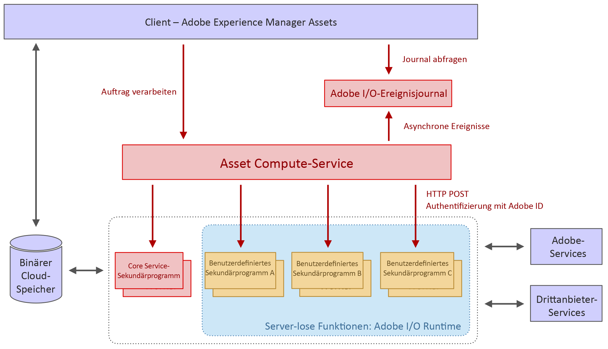

# Architektur von [!DNL Asset Compute Service] {#overview}

Die [!DNL Asset Compute Service] basiert auf der Server-losen Adobe [!DNL `I/O Runtime`] Plattform. Der Service bietet Unterstützung mit Adobe Sensei-Inhalts-Services für Assets. Der aufrufende Client (es wird nur [!DNL Experience Manager] as a [!DNL Cloud Service] unterstützt) erhält die von Adobe Sensei generierten Informationen, nach denen er für das Asset gesucht hat. Die zurückgegebenen Informationen liegen im JSON-Format vor.

[!DNL Asset Compute Service] kann erweitert werden, indem benutzerdefinierte Programme basierend auf [!DNL Adobe Developer App Builder] erstellt werden. Diese benutzerdefinierten Programme sind Headless-[!DNL Project Adobe Developer App Builder]-Apps und führen Aufgaben wie das Hinzufügen benutzerdefinierter Konvertierungs-Tools oder den Aufruf externer APIs durch, um Bildvorgänge auszuführen.

[!DNL Project Adobe Developer App Builder] ist ein Framework zum Erstellen und Bereitstellen benutzerdefinierter Webanwendungen auf der Adobe [!DNL `I/O Runtime`]. Um benutzerdefinierte Programme zu erstellen, können die Entwickler [!DNL React Spectrum] (Adobe UI-Toolkit), erstellen Sie benutzerdefinierte Ereignisse und orchestrieren Sie APIs. Siehe [Dokumentation zu Adobe Developer App Builder](https://developer.adobe.com/app-builder/docs/overview).

Die Architektur basiert auf dem Folgenden:

* Die Modularität von Anwendungen, die nur das enthalten, was für eine bestimmte Aufgabe benötigt wird, ermöglicht es, die Anwendungen voneinander zu entkoppeln und einfach zu halten.

* Das Server-lose Konzept von [!DNL Adobe I/O] Runtime bietet zahlreiche Vorteile: asynchrone, hochskalierbare, isolierte, vorgangsbasierte Verarbeitung, die sich ideal für die Asset-Verarbeitung eignet.

* Der binäre Cloud-Speicher bietet die erforderlichen Funktionen zum individuellen Speichern von und Zugreifen auf Asset-Dateien und -Ausgabedarstellungen, ohne dass volle Zugriffsberechtigungen auf den Speicher erforderlich sind, und zwar unter Verwendung von vorab signierten URL-Referenzen. Übertragungsbeschleunigung, CDN-Caching und die gemeinsame Speicherung von Compute-Programme im Cloud-Speicher ermöglichen einen optimalen Zugriff auf Inhalte mit geringer Latenz. Es werden sowohl AWS- als auch Azure-Clouds unterstützt.

*Abbildung: Architektur von [!DNL Asset Compute Service] und wie der Service mit [!DNL Experience Manager], Datenspeicherung und Verarbeitungsprogrammen zusammenarbeitet.*

Die Architektur besteht aus folgenden Teilen:

* **Eine API- und Orchestrierungsebene** empfängt Anforderungen (im JSON-Format), die den Service anweisen, ein Quellelement in mehrere Ausgabedarstellungen umzuwandeln. Die Anfragen sind asynchron und werden mit einer Aktivierungs-ID zurückgegeben, die die Auftrags-ID ist. Anweisungen sind rein deklarativ, und für alle standardmäßigen Verarbeitungsvorgänge (z. B. Erstellung von Miniaturansichten, Textextraktion) geben Verbraucher nur das gewünschte Ergebnis an, nicht jedoch die Anwendungen, die bestimmte Ausgabedarstellungen verarbeiten. Generische API-Funktionen wie Authentifizierung, Analyse, Ratenbegrenzung werden über das Adobe API Gateway vor dem Service abgewickelt und verwalten alle Anfragen, die an [!DNL Adobe I/O] Runtime gesendet werden. Das Programm-Routing wird dynamisch von der Orchestrierungsebene ausgeführt. Clients definieren benutzerdefinierte Programme für bestimmte Ausgabedarstellungen, die mit ihrem eigenen Satz eindeutiger Parameter geliefert werden. Die Anwendungsausführung kann vollständig parallelisiert werden, da es sich um separate Server-lose Funktionen im Adobe handelt [!DNL `I/O Runtime`].

* **Anwendungen zur Verarbeitung von Assets** , die sich auf bestimmte Dateiformate oder Zielausgabeformate spezialisiert haben. Eine Anwendung ähnelt dem UNIX®-Pipe-Konzept: Eine Eingabedatei wird in eine oder mehrere Ausgabedateien umgewandelt.

* **A [Allgemeine Anwendungsbibliothek](https://github.com/adobe/asset-compute-sdk)** verarbeitet allgemeine Aufgaben. Beispielsweise das Herunterladen der Quelldatei, das Hochladen der Ausgabedarstellungen, die Fehlerberichterstellung, das Senden von Ereignissen und die Überwachung. Dieses Design stellt sicher, dass die Anwendungsentwicklung unkompliziert bleibt und dem Server-losen Konzept entspricht, wobei die Interaktionen auf das lokale Dateisystem beschränkt sind.

<!-- TBD:

* About the YAML file?
* minimize description to custom applications
* remove all internal stuff (e.g. Photoshop application, API Gateway) from text and diagram
* update diagram to focus on 3rd party custom applications ONLY
* Explain important transactions/handshakes?
* Flow of assets/control? See the illustration on the Nui diagrams wiki.
* Illustrations. See the SVG shared by Alex.
* Exceptions? Limitations? Call-outs? Gotchas?
* Do we want to add what basic processing is not available currently, that is expected by existing AEM customers?
-->
